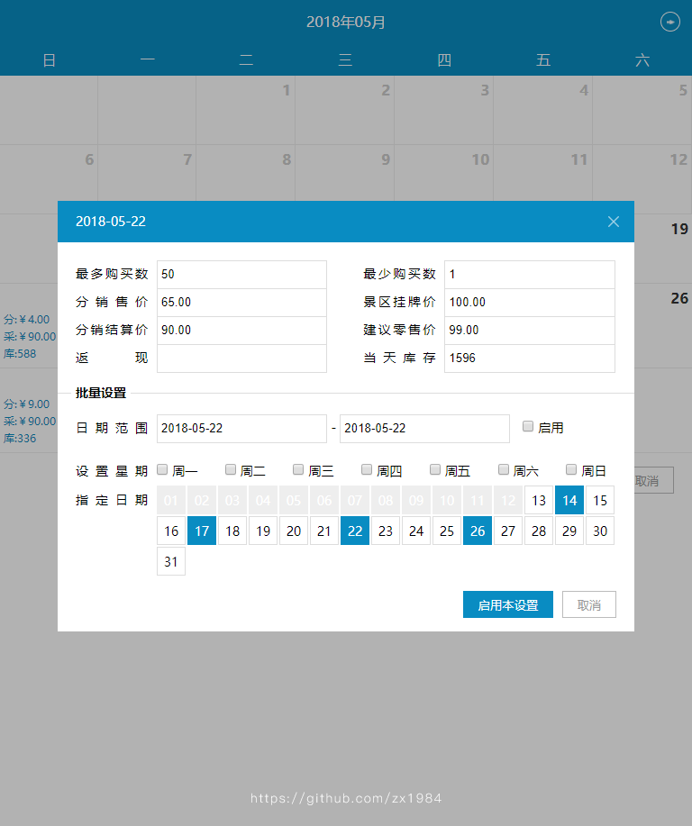
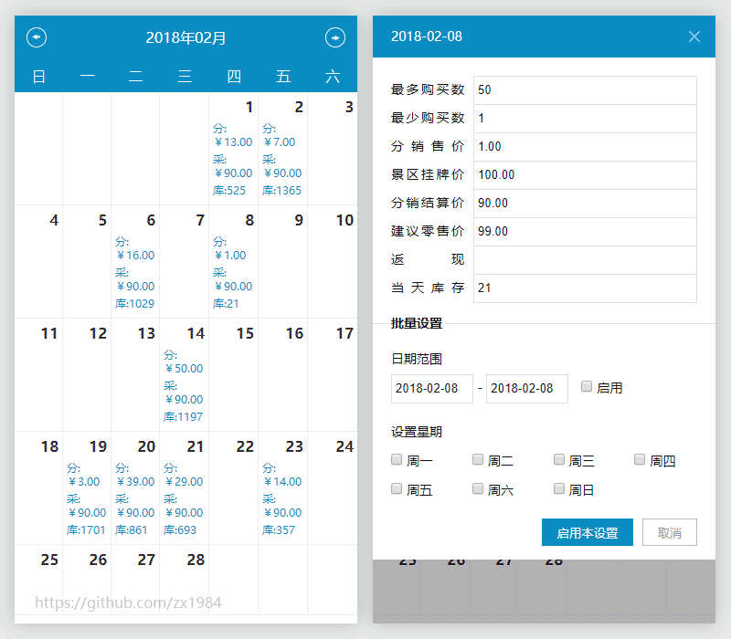
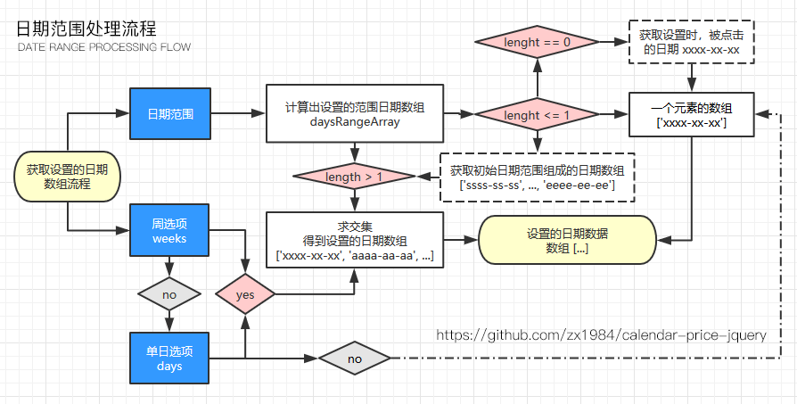

# Calendar-price-jquery

基于Jquery的日历价格、库存等设置插件，也可以作为前台显示日期、价格用。需要设置的参数(字段)需自定义，详见(demo)使用方法...

> 浏览器兼容：ie9+

#### 主要功能

* 自定义日历显示参数

* 自定义需要设置的参数

* 自定义插件的样式风格(颜色)

#### npm

```
npm install calendar-pirce-jquery --save-dev
```


## 使用效果图

PC端



移动端



## 日历范围处理流程



## 使用方法

```html
<!DOCTYPE html>
<html>
<head>
  <meta charset="UTF-8">
  <title>Capricorncd Calendar-Price-jQuery</title>
  <!-- 引入日历样式文件 -->
  <link rel="stylesheet" href="../dist/css/calendar-price-jquery.min.css">
</head>
<body>

<!-- 日历显示的容器 -->
<div class="container"></div>

<!-- 引入jQuery.js文件 -->
<script src="jquery-1.12.4.min.js"></script>
<!-- 引入日历价格设置插件js文件 -->
<script src="../dist/js/calendar-price-jquery.min.js"></script>
<script>
  // 以下mockData是模拟JSON数据，一般情况是从后端(服务器端)获取
  // 对象中'date'字段必须，且格式一定要为0000-00-00
  // 除'date'以为的字段需自定义，然后必须在config:[]中配置
  // 需要在日历中显示参数，需在show:[]中配置
  var mockData = [
    {
      date: "2017-06-21",
      stock: "9000",
      buyNumMax: "50",
      buyNumMin: "1",
      price: "0.12",
      priceMarket: "100.00",
      priceSettlement: "90.00",
      priceRetail: "99.00"
    },{
      date: "2017-07-12",
      stock: "9000",
      buyNumMax: "50",
      buyNumMin: "1",
      price: "12.00",
      priceMarket: "100.00",
      priceSettlement: "90.00",
      priceRetail: "99.00"
    }
  ];

  // 使用插件
  $(function () {
      // 日历设置参数配置
      var calendarConfig = [
        {
          key: 'buyNumMax',
          name: '最多购买数',
          type: 'number',
          placeholder: '请输入最多购买数量',
          // 可被编辑字段，即会显示对于input
          editable: true
        },
        {
          key: 'price',
          name: '分销售价',
          type: 'text',
          placeholder: '请输入',
          // 不能编辑，不会显示该项input
          editable: false
        },
        {
          key: 'priceMarket',
          name: '景区挂牌价',
          type: 'text',
          placeholder: '请输入',
          // input为禁用状态
          disabled: true
        },
        ...
      ]

      // 日历中显示配置
      var showConfig = [
        {
          key: 'price',
          name: '分:￥'
        },
        {
          key: 'priceSettlement',
          name: '采:￥'
        },
        {
          key: 'buyNumMax',
            name: '采:￥'
          },
        ...
      ]

    var zxCalendar = $.CalendarPrice({
      // 显示日历的容器
      el: '.container',
      // 设置开始日期
      // 可选参数，默认为系统当前日期
      startDate: '2017-08-02',
      // 可选参数，默认为开始日期相同的1年后的日期
      // 设置日历显示结束日期
      endDate: '2017-09',
      // 初始数据
      data: mockData,
      // 配置需要设置的字段名称，请与你传入的数据对象对应
      config: calendarConfig,
      // 配置在日历中要显示的字段
      show: showConfig,
      // 自定义风格(颜色)
      style: {
        // 详见参数说明
        // ...
        // 头部背景色
        //headerBgColor: '#f00',
        // 头部文字颜色
        //headerTextColor: '#fff'
      }
    });

  });

</script>

</body>
</html>
```

事件监听

```javascript
var zxCalendar = $.CalendarPrice({'配置参数'});

// 监听设置表单提交
// 将阻止默认流程执行
// 继续执行默认流程，请执行参数next()
zxCalendar.$on('submit-form', function (data, next) {
  // data 设置的数据
  console.log('$(submit-form)表单数据 ================')
  console.log(data)

  // 此处可以验证表单
  // 验证表单逻辑....
  // ....

  // 继续执行下一步
  next()
})

// 执行过程中错误回调
zxCalendar.$on('error', function (err) {
  // 执行中的错误提示
  console.error('$on(error)Error:')
  console.log(err)
  alert(err.msg);
})

// 切换月份
zxCalendar.$on('month-change', function (data) {
  log('$on(month-change) 数据：');
  log(data);
})

// 点击有效的某一天通知
zxCalendar.$on('valid-day', function (day, data, next) {
  log('$on(valid-day)当前点击的(有效)日期为: ' + day + ', 数据：');
  log(data);

  // 继续执行默认流程
  next();
})

// 设置数据变化
zxCalendar.$on('setup-value-change', function (data) {
  log('$on(setup-value-change)设置窗口被修改数据....');
  log(data);
  // 取消设置
  // 这里可以触发关闭设置窗口
})

// 点击重置按钮回调
zxCalendar.$on('reset', function () {
  log('$on(reset)数据重置成功！');
})

// 点击确定按钮回调，返回当前设置数据
zxCalendar.$on('confirm', function (data) {
  log('$on(confirm)点击确定按钮通知！');
  log(data);
})

// 点击取消按钮回调
zxCalendar.$on('cancel', function () {
  log('$on(cancel)取消设置 ....');
  // 取消设置
  // 这里可以触发关闭设置窗口
})
```

## Options 参数

* cancel(): `Function` (可选)， 点击`取消`按钮的回调函数。

* callback(data): `Function` (可选)， 点击`确定`按钮，返回设置完成的所有数据。

* config: `Array` (必须)，与data中的数据参数(属性)对应，该配置里的配置项，即可设置的参数字段，`key` 为需要设置的字段，`name`为输入框前面显示的名称。

|元素字段|类型|必须|说明|
|:--|:--|:--|:--|
|disabled|boolean|否|是否禁用input输入，默认为`false`|
|editable|boolean|否|是否显示该项input，默认为`true`|

* data: `Object` (可选)，初始时日历上显示的数据，详见使用方法。

* disableSetup: `Boolean` (可选)禁用设置窗口显示。当该插件在前台web页面中作为展示时，不需要弹出设置窗口操作，则可以禁用设置窗口。默认值为`false`。

* el: `String` (必须)，显示日历的容器，jquery选择器均可(#id, \[属性], .class等)。

* endDate: `String` (可选)，结束日期。日历中可设置数据的结束日期，该日期以后的月份将不能显示或操作，同`startDate`，支持某月(默认去该月最后一天)或某天。若未配置此项，系统默认为1年后的今日，即日期范围为1年。

* error(errObject): `Function` (可选)， 配置或操作中的错误、提示信息等回调函数。

* everyday(dayData): `Function` (可选)， 点击有效的`某日`，返回当天的数据。注意：配置了此参数，设置窗口无效，即不能针对日期做参数设置。

* hideFooterButton: `Boolean` (可选)， 隐藏底部按钮（重置、确定、取消）。前台使用该插件时，则需要隐藏底部按钮，只做日历/价格显示。默认值`false`。

* monthChange(monthData): `Function` (可选) 月份切换时，返回切换前日历数据

* show: `Array` (可选)， 日历中需要显示的参数(属性)，与data中的数据参数(属性)对应。`key` 为需要设置的字段名，`name`为显示在日历中的名称(简称)。

* startDate: `2017-06-20` (可选)，开始日期。可设置数据的开始日期，该日期以前的月份将不能设置或操作，支持某月`2017-06`或某天。开始日期开始日期未配置或小于当前系统时间，则开始日期取今日。

* style: `自定义颜色`

```javascript
// 自定义颜色属性
{
  // 头部背景色
  headerBgColor: '#098cc2',
    // 头部文字颜色
    headerTextColor: '#fff',
  // 周一至周日背景色，及文字颜色
  weekBgColor: '#098cc2',
  weekTextColor: '#fff',
  // 周末背景色，及文字颜色
  weekendBgColor: '#098cc2',
  weekendTextColor: '#fff',
  // 有效日期颜色
  validDateTextColor: '#333',
  validDateBgColor: '#fff',
  validDateBorderColor: '#eee',
  // Hover
  validDateHoverBgColor: '#098cc2',
  validDateHoverTextColor: '#fff',
  // 无效日期颜色
  invalidDateTextColor: '#ccc',
  invalidDateBgColor: '#fff',
  invalidDateBorderColor: '#eee',
  // 底部背景颜色
  footerBgColor: '#fff',
  // 重置按钮颜色
  resetBtnBgColor: '#77c351',
  resetBtnTextColor: '#fff',
  resetBtnHoverBgColor: '#55b526',
  resetBtnHoverTextColor: '#fff',
  // 确定按钮
  confirmBtnBgColor: '#098cc2',
  confirmBtnTextColor: '#fff',
  confirmBtnHoverBgColor: '#00649a',
  confirmBtnHoverTextColor: '#fff',
  // 取消按钮
  cancelBtnBgColor: '#fff',
  cancelBtnBorderColor: '#bbb',
  cancelBtnTextColor: '#999',
  cancelBtnHoverBgColor: '#fff',
  cancelBtnHoverBorderColor: '#bbb',
  cancelBtnHoverTextColor: '#666'
}
```

## Method 方法

* $on('event-name', callback)

|事件名|参数|说明|
|:--|:--|:--|
|cancel|undefiend|点击取消按钮通知/回调|
|confirm|(data)|点击确定按钮通知/回调|
| |data `Object`| 设置的所有数据对象 |
|error|(errData)|执行过程中的错误通知/回调|
| |errData `Object`|错误码，及错误消息对象|
|month-change|(data)|切换月份前触发，返回该月设置数据|
| |data `Object`|该月设置数据|
|reset|undefiend|点击重置按钮通知/回调|
|setup-close|undefiend|设置窗口关闭通知/回调|
|setup-value-change|(data)|设置窗口，设置数据被修改触发的通知/回调|
||data `Object`|返回当前被修改对象的`{name: 'objectName', value: '被修改后的值'}, $el: '当前被修改元素jQuery对象'`|
|submit-form|(data, next)|设置窗口点击确定时通知/回调，返回设置的数据data|
| |data `Object`|当前设置窗口中设置的数据|
| |next() `Function`|继续执行下一步函数；`注意`不执行该函数将阻止默认流程继续执行|
|valid-day|(day, data, next)|点击有效的某一天，触发的事件通知/回调|
| |day `String`|当前点击日期，格式yyyy-MM-dd|
| |data `Object`|当前点击日期对应设置的数据|
| |next() `Function`|继续执行下一步函数，不执行该函数将阻止默认流程继续执行；`注意`不调用该函数将阻止默认流程执行！|

* getMonthData() 获取当前显示月份的数据

* update(newArrayData) 更新日历数据；参数为新的数据。

## Copyright and license

https://github.com/capricorncd

Code and documentation copyright 2018. capricorncd. Code released under the MIT License.
